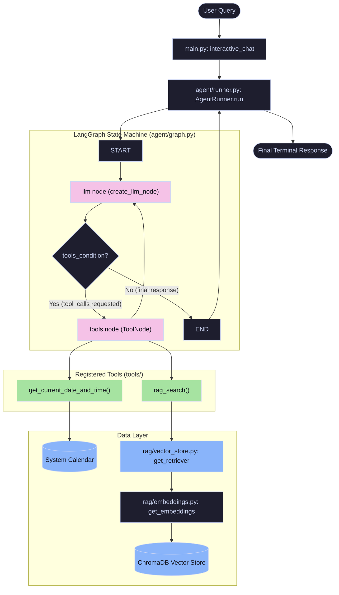

# 🚀 Comprehensive Guide: AI Agent & RAG Architecture

Welcome to the definitive guide for understanding, configuring, and modifying this AI Agent project. This guide is designed for developers who want to deeply understand how modern AI Agents, RAG (Retrieval-Augmented Generation), and Tool-Calling loops work under the hood using **LangGraph** and **LangChain**.

---

## 📖 Table of Contents
1. [Core Concepts](#1-core-concepts-what-are-we-building)
2. [Setup & Configuration (.env Demystified)](#2-setup--configuration-env-demystified)
3. [File-by-File Breakdown](#3-file-by-file-breakdown)
4. [Detailed Component Flow & Function Reference](#4-detailed-component-flow--function-reference)
5. [Execution Flow Walkthrough with Example & Sample Data](#5-execution-flow-walkthrough-with-example--sample-data)
6. [Understanding the Agent Loop (LangGraph)](#6-understanding-the-agent-loop-langgraph)
7. [Understanding RAG](#7-understanding-rag-retrieval-augmented-generation)
8. [Modifying for Your Use Case](#8-modifying-for-your-use-case)

---

## 1. Core Concepts: What are we building?

Before diving into code, let's understand the three pillars of this project:

*   **RAG (Retrieval-Augmented Generation):** LLMs are frozen in time and don't know your private data. RAG solves this by converting your text documents into numbers (Embeddings), storing them in a database, and performing a "similarity search" when a user asks a question. The relevant text is then fed to the LLM as context.
*   **Tool Calling:** Standard LLMs just generate text. A "Tool-Calling" LLM can decide to execute Python functions. You provide the LLM a list of tools (like `calculate_metrics` or `search_database`), and the LLM responds with a JSON payload telling your code *which tool to run* and *with what arguments*.
*   **AI Agent (The Loop):** An Agent is an LLM running in a continuous feedback loop. It thinks: *"What should I do next? Do I have the answer? No? Let me call a tool."* It runs the tool, sees the result, and thinks again. This is powered by **LangGraph**.

---

## 2. Setup & Configuration (.env Demystified)

This project uses `llm_factory.py` to seamlessly switch between different AI providers without changing your core agent logic.

Here is exactly how to configure your `.env` for different scenarios:

### Scenario A: Using Google Gemini Natively
If you want to use Google's free Gemini API directly:
```env
LLM_PROVIDER=gemini
GOOGLE_API_KEY=AIzaSy...your_key...
# (You can leave the OPENAI variables empty or commented out)
```

### Scenario B: Using Standard OpenAI (ChatGPT)
If you have an OpenAI account and want to use GPT-4o:
```env
LLM_PROVIDER=openai
OPENAI_API_KEY=sk-proj-...your_key...
OPENAI_MODEL=gpt-4o
# (You must delete or comment out OPENAI_BASE_URL so it defaults to OpenAI's real servers)
```

### Scenario C: Using OpenCode, Zen, or OpenRouter (OpenAI-Compatible Endpoints)
Many services provide free/cheaper models using OpenAI's exact API format. This is what we are using!
```env
LLM_PROVIDER=openai
OPENAI_API_KEY=sk-your-zen-or-opencode-key
OPENAI_BASE_URL=https://opencode.ai/zen/v1   # The custom endpoint!
OPENAI_MODEL=minimax-m2.5-free               # The model name provided by your service
```
*Why this works:* The LangChain `ChatOpenAI` client will send requests to `OPENAI_BASE_URL` instead of OpenAI's servers, allowing you to use open-source or third-party models seamlessly.

---

## 3. File-by-File Breakdown

Here is what every file does in the system:

*   **`main.py`**: The entry point. It sets up environment variables, initializes the Agent, and runs the interactive `You: / Agent:` chat loop in your terminal.
*   **`config.py`**: Reads your `.env` file and strictly validates it. If you are missing a required key for your chosen provider, it crashes early with a clear error.
*   **`llm_factory.py`**: The adapter. Depending on your `.env`, it creates either a `ChatGoogleGenerativeAI` object or a `ChatOpenAI` object. 
*   **`agent/graph.py`**: The heart of the agent. This defines the **LangGraph StateGraph** (the flow chart of the agent's brain) and handles long-term memory via the `MemorySaver` checkpointer.
*   **`agent/runner.py`**: A clean wrapper class that hides the complexity of LangGraph. It provides the `_get_system_prompt()` (the Agent's persona) and the `.run()` method to stream outputs to the terminal.
*   **`rag/embeddings.py`**: Uses `SentenceTransformers` to convert text into numbers (vectors) locally on your CPU for free, without needing API calls.
*   **`rag/vector_store.py`**: Manages `ChromaDB`, a local database that stores your embedded vectors and performs the similarity searches.
*   **`data/ingest.py`**: A script you run manually once. It reads `.md` files, chunks them into small paragraphs, and saves them into ChromaDB.
*   **`tools/rag_tool.py`**: The bridge between RAG and the Agent. It wraps the ChromaDB search inside an `@tool` decorator so the LLM can trigger it autonomously.

---

## 4. Detailed Component Flow & Function Reference

This section provides a complete map of every function in the codebase, detailing its purpose, inputs, and outputs to help you learn how they work and communicate with each other.

### 🔌 1. Core Entry & Interactive Interface (`main.py`)
*   **`main()`**
    *   *Purpose*: The main entry point. Orchestrates startup tasks by validating environment config, auto-ingesting standard knowledge documents if the vector store is empty, initializing the `AgentRunner`, and starting the chat loop.
    *   *Input*: None
    *   *Output*: None
*   **`maybe_ingest()`**
    *   *Purpose*: Automates document ingestion. Checks if ChromaDB contains stored vectors; if empty, it triggers `run_ingestion()`.
    *   *Input*: None
    *   *Output*: None
*   **`vector_store_is_populated()`**
    *   *Purpose*: Returns whether the local vector database contains indexed data.
    *   *Input*: None
    *   *Output*: `bool` (True if ChromaDB count > 0, else False)
*   **`interactive_chat(agent)`**
    *   *Purpose*: Runs the command-line REPL chat interface, listening to user queries and routing special commands (`/quit`, `/history`, `/new`, `/tools`).
    *   *Input*: `agent` (an `AgentRunner` instance)
    *   *Output*: None

### ⚙️ 2. Configuration (`config.py`)
*   **`Config.validate()`**
    *   *Purpose*: Reads and validates environment variables. Fails fast with an `EnvironmentError` if keys (e.g. `OPENAI_API_KEY` or `GOOGLE_API_KEY`) are missing for the selected provider.
    *   *Input*: None
    *   *Output*: None

### 🏗️ 3. LLM Connection Adapter (`llm_factory.py`)
*   **`get_llm(temperature)`**
    *   *Purpose*: Instantiates and returns a LangChain chat model client (`ChatGoogleGenerativeAI` or `ChatOpenAI`) based on the `.env` settings.
    *   *Input*: `temperature: float`
    *   *Output*: `BaseChatModel`

### 🧠 4. The Agent Graph & Orchestration (`agent/`)
*   **`build_agent_graph(temperature)`** (in [graph.py](file:///d:/proj/aiagent-rag/agent/graph.py))
    *   *Purpose*: Declares the LangGraph state machine, binds the `ALL_TOOLS` list to the LLM model, adds graph nodes, defines transitions (edges and conditional edges), sets up `MemorySaver` checkpointer persistence, and compiles it.
    *   *Input*: `temperature: float` (defaults to `0.0` for predictable tool-calling)
    *   *Output*: `CompiledGraph`
*   **`create_llm_node(llm_with_tools)`** (in [graph.py](file:///d:/proj/aiagent-rag/agent/graph.py))
    *   *Purpose*: Closure factory generating the `llm_node()` node function.
    *   *Input*: `llm_with_tools` (Chat model with bound tool descriptions)
    *   *Output*: `llm_node(state)` function
*   **`llm_node(state)`** (in [graph.py](file:///d:/proj/aiagent-rag/agent/graph.py))
    *   *Purpose*: Prepends the system prompt instruction to the message list, executes the LLM, and returns the LLM's response message back to the graph state.
    *   *Input*: `state: AgentState`
    *   *Output*: `dict` (a state patch containing the new `AIMessage` or tool-call request)
*   **`AgentRunner.__init__(thread_id)`** (in [runner.py](file:///d:/proj/aiagent-rag/agent/runner.py))
    *   *Purpose*: Class constructor that registers the compiled graph, sets up a unique thread ID session, and builds a short-term `ConversationMemory` helper.
    *   *Input*: `thread_id: Optional[str]`
    *   *Output*: None
*   **`AgentRunner.run(user_input, verbose)`** (in [runner.py](file:///d:/proj/aiagent-rag/agent/runner.py))
    *   *Purpose*: Hides LangGraph plumbing from `main.py`. Wraps user input in a `HumanMessage`, streams the graph's execution, prints step-by-step tool execution logs to the console in real-time, updates memory, and returns the final output.
    *   *Input*: `user_input: str`, `verbose: bool`
    *   *Output*: `str` (the final AI answer)
*   **`AgentRunner.new_session()`** (in [runner.py](file:///d:/proj/aiagent-rag/agent/runner.py))
    *   *Purpose*: Assigns a new random `thread_id` to start a fresh conversational thread, purging old persistent checkpointer states.
    *   *Input*: None
    *   *Output*: None

### 🔍 5. Local RAG Pipeline (`rag/` & `data/`)
*   **`get_embeddings()`** (in [embeddings.py](file:///d:/proj/aiagent-rag/rag/embeddings.py))
    *   *Purpose*: Initializes the HuggingFace `SentenceTransformerEmbeddings` model (`all-MiniLM-L6-v2`) locally to compute semantic representations of texts.
    *   *Input*: None
    *   *Output*: `SentenceTransformerEmbeddings`
*   **`get_vector_store()`** (in [vector_store.py](file:///d:/proj/aiagent-rag/rag/vector_store.py))
    *   *Purpose*: Resolves or creates a ChromaDB vector store directory.
    *   *Input*: None
    *   *Output*: `Chroma`
*   **`ingest_documents(documents)`** (in [vector_store.py](file:///d:/proj/aiagent-rag/rag/vector_store.py))
    *   *Purpose*: Splits raw texts into chunks (~500 chars with 100 char overlap) using `RecursiveCharacterTextSplitter`, calls the embedding model, and saves them in ChromaDB.
    *   *Input*: `documents: List[Document]`
    *   *Output*: `Chroma`
*   **`get_retriever()`** (in [vector_store.py](file:///d:/proj/aiagent-rag/rag/vector_store.py))
    *   *Purpose*: Exposes a LangChain retriever interface configured to fetch the top `k` matching document chunks.
    *   *Input*: None
    *   *Output*: `VectorStoreRetriever`
*   **`load_documents_from_directory(directory)`** (in [ingest.py](file:///d:/proj/aiagent-rag/data/ingest.py))
    *   *Purpose*: Loops over raw files in `data/knowledge_base/` and loads `.md` and `.txt` files as `Document` instances.
    *   *Input*: `directory: str`
    *   *Output*: `list[Document]`

### 🔧 6. Agent Tools (`tools/`)
*   **`rag_search(query)`** (in [rag_tool.py](file:///d:/proj/aiagent-rag/tools/rag_tool.py))
    *   *Purpose*: A tool wrapping ChromaDB similarity search to retrieve text snippets matching the search criteria.
    *   *Input*: `query: str`
    *   *Output*: `str`
*   **`get_current_date_and_time()`** (in [utility_tools.py](file:///d:/proj/aiagent-rag/tools/utility_tools.py))
    *   *Purpose*: Exposes system timezone, current date/time, year progress, and current quarter.
    *   *Input*: None
    *   *Output*: `str`

---

## 5. Execution Flow Walkthrough with Example & Sample Data

To understand how these components interact, let's walk through a concrete example.

### 📝 Scenario & Sample Data

Suppose our local knowledge base contains:
*   **Knowledge Base File (`Async Rust (Maxwell Flitton, Caroline Morton).pdf`)**:
    *   Contains descriptions of Async Rust concepts and lists the authors Maxwell Flitton and Caroline Morton.

---

### 🔄 Step-by-Step Flow

#### Step 1: User Query Input
The user types the query:
> *"What is Async Rust, and who is the author of the Async Rust book? Mention the date you are checking this."*
The REPL loop in `main.py` passes this string to `AgentRunner.run()`.

#### Step 2: Session Initialization & Graph State Setup
`AgentRunner` saves the message to short-term memory (`self.memory`), wraps it in a LangChain `HumanMessage`, and starts streaming graph execution:
*   **Graph State Initialization**: `state = {"messages": [HumanMessage(content="What is Async Rust...")]}`

#### Step 3: Reasoning Node (`llm_node`)
The graph moves to the `"llm"` node.
1.  `llm_node()` is invoked, prepending the `SYSTEM_PROMPT` to the state messages.
2.  `llm.bind_tools(ALL_TOOLS)` evaluates the query. The LLM understands that:
    *   It needs semantic details about Async Rust and its authors. It schedules `rag_search(query="Async Rust book author definition")`.
    *   It needs the current date and time. It schedules a `get_current_date_and_time()` tool call.
3.  The node returns the LLM response containing these 2 `tool_calls` requests.

#### Step 4: Routing Check (`tools_condition`)
LangGraph checks the `AIMessage` returned by the LLM node:
*   Because it contains `tool_calls`, the conditional edge routes execution to the `"tools"` node.

#### Step 5: Tools Execution (`ToolNode`)
The `ToolNode` executes the requested functions:
1.  **`rag_search("Async Rust book author definition")`**:
    *   Calls `get_retriever().invoke("Async Rust...")` which uses HuggingFace embeddings (`embeddings.py`) to encode the text query.
    *   Queries `ChromaDB` (`vector_store.py`) to find matching document chunks from the `Async Rust` PDF.
    *   Returns the matched text snippets.
2.  **`get_current_date_and_time()`** returns the system's current timezone, date, and year progress details.
*   The results are appended to the state graph as `ToolMessage`s.

#### Step 6: Loop Back to Reasoning Node (`llm_node`)
The graph follows the fixed edge from `"tools"` back to `"llm"`.
1.  `llm_node()` is invoked again. The model is now provided with:
    *   The original user prompt.
    *   Its own tool call commands.
    *   The results returned by the tools (Async Rust concepts, the book's authors, and the current date).
2.  The LLM synthesizes this combined information to build a coherent final response.
3.  The node returns the final synthesized markdown response.

#### Step 7: Final End Route (`tools_condition`)
LangGraph checks the latest response. Since it is a text-only response (no further tool calls requested), it routes the flow to the `END` state.
*   `AgentRunner.run()` records the final answer in memory and returns it to `main.py`, which prints it to the user.

---

### 📊 System Architecture & Data Flow Diagram

Below is the conceptual flow diagram representing the full lifecycle of a user query processing through the system.



---

## 6. Understanding the Agent Loop (LangGraph)

If you look inside `agent/graph.py`, you will see we define a `StateGraph`. Think of this as a state machine:

1.  **START**: User asks "What is the policy?"
2.  **LLM Node (`call_model`)**: The LLM looks at the question and its available tools. It realizes it doesn't know the policy. It outputs a `tool_call` request for `rag_search`.
3.  **Conditional Edge (`should_continue`)**: LangGraph intercepts the LLM's response. It says: *"Did the LLM ask for a tool? Yes? Route to the Tool Node. No? Route to END."*
4.  **Tool Node (`tools`)**: Python executes `rag_search(query="policy")` and gets the text from the database. It attaches this text to the conversation history as a "Tool Message".
5.  **Back to LLM Node**: LangGraph routes back to step 2. The LLM now sees the user's question *and* the database results. It synthesizes a final answer and outputs plain text.
6.  **END**: The conditional edge sees no tool calls, routes to END, and the answer is printed to the user.

---

## 7. Understanding RAG (Retrieval-Augmented Generation)

When you run `python data/ingest.py`, here is what happens:
1.  **Load**: `TextLoader` reads your markdown files.
2.  **Chunk**: `RecursiveCharacterTextSplitter` breaks the long document into ~1000-character chunks. (LLMs have context limits, and vector searches are more accurate on smaller chunks).
3.  **Embed**: The `all-MiniLM-L6-v2` AI model converts the text of each chunk into a 384-dimensional array of floats (a vector). 
4.  **Store**: These arrays are saved into the `chroma_db` folder.

When the agent uses `rag_search("remote work policy")`:
1. It embeds the query "remote work policy" into a 384-dimensional vector.
2. It asks ChromaDB: *"Which stored vectors are mathematically closest to this query vector?"*
3. ChromaDB returns the original text chunks, which are fed to the LLM.

---

## 8. Modifying for Your Use Case

To make this project your own, follow these 3 steps:

### A. Change the Agent's Persona
Open `agent/graph.py`. Find `SYSTEM_PROMPT`. Rewrite it completely!
*"You are a highly strictly customer support bot for Company X. Never apologize. Always check the knowledge base before answering..."*

### B. Add Your Own Knowledge
1. Delete the dummy files in `data/knowledge_base/`.
2. Add your company's PDFs, TXT, or MD files. (You may need to update `ingest.py` to use `PyPDFLoader` if using PDFs).
3. Delete the `chroma_db/` folder to clear old memory.
4. Run `python data/ingest.py`.

### C. Build Custom Tools
Want your agent to do real things? Create a tool in `tools/custom_tools.py`:
```python
from langchain_core.tools import tool
import requests

@tool
def trigger_webhook(user_id: str, action: str) -> str:
    """Use this tool to trigger a server action for a specific user ID."""
    # Your python code here
    requests.post("https://your-api.com/trigger", json={"id": user_id, "action": action})
    return "Webhook triggered successfully."
```
Add `trigger_webhook` to the `TOOLS` list in `tools/__init__.py`. The LLM will now read your docstring and use the tool whenever a user asks to trigger an action!
